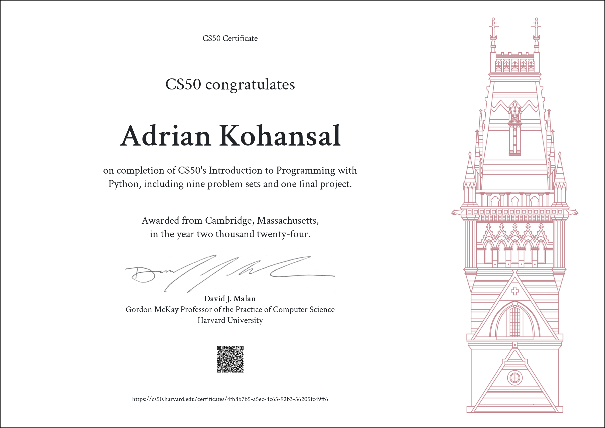

# CS50: Computer Science Courses and Programs from Harvard
Presented by EdX - [https://www.edx.org/learn/python/harvard-university-cs50-s-introduction-to-programming-with-python?webview=false&campaign=CS50%27s+Introduction+to+Programming+with+Python&source=edx&product_category=course&placement_url=https%3A%2F%2Fwww.edx.org%2Fcs50](https://www.edx.org/cs50)

## About 

Introduction to Computer Science from Harvard, better known as CS50, is the largest course on the Harvard campus.

## Structure
### CS50P
An introduction to programming using a language called Python. Learn how to read and write code as well as how to test and "debug" it. Designed for students with or without prior programming experience who'd like to learn Python specifically. Learn about functions, arguments, and return values (oh my!); variables and types; conditionals and Boolean expressions; and loops. Learn how to handle exceptions, find and fix bugs, and write unit tests; use third-party libraries; validate and extract data with regular expressions; model real-world entities with classes, objects, methods, and properties; and read and write files. Hands-on opportunities for lots of practice. Exercises inspired by real-world programming problems. No software required except for a web browser, or you can write code on your own PC or Mac.

Whereas CS50x itself focuses on computer science more generally as well as programming with C, Python, SQL, and JavaScript, this course, aka CS50P, is entirely focused on programming with Python. You can take CS50P before CS50x, during CS50x, or after CS50x. But for an introduction to computer science itself, you should still take CS50x!

Lecture 00 - Functions, Variables  
Lecture 01 - Conditionals  
Lecture 02 - Loops  
Lecture 03 - Exceptions  
Lecture 04 - Libraries  
Lecture 05 - Unit Tests  
Lecture 06 - File I/O  
Lecture 07 - Regular Expressions  
Lecture 08 - Object-Oriented Programming  
Lecture 09 -  Et Cetera  

## CS50P Gradebook
<!-- https://github.com/gepser/markdown-progress -->
| Week      | Type | Title | Grade|
| ----------- | ----------- | ----------- | ------------- |
| 0      | Homework  | Indoor Voice    | 
| 0      | Homework  | Playback Speed    | 
| 0      | Homework  | Making Faces    | 
| 0      | Homework  | Einstein    | 
| 0      | Homework  | Tip Calculator    | 
| 1      | Homework  | Deep Thought    | 
| 1      | Homework  | Home Federal Savings Bank    | 
| 1      | Homework  | File Extensions    | 
| 1      | Homework  | Math Interpreter    | 
| 1      | Homework  | Meal Time    | 
| 2      | Homework  | camelCase    | 
| 2      | Homework  | Coke Machine    | 
| 2      | Homework  | Just setting up my twttr   | 
| 2      | Homework  | Vanity Plates    | 
| 2      | Homework  | Nutrition Facts    | 
| 3      | Homework  | Fuel Gauge   | 
| 3      | Homework  | Felipe’s Taqueria    | 
| 3      | Homework  | Grocery List    | 
| 3      | Homework  | Outdated    | 
| 4      | Homework | Emojize    | 
| 4      | Homework | Frank, Ian and Glen’s Letters    | 
| 4      | Homework | Adieu, Adieu    | 
| 4      | Homework | Guessing Game    | 
| 4      | Homework | Little Professor    | 
| 4      | Homework | Bitcoin Price Index    | 
| 5      | Homework | Testing my twttr | 
| 5      | Homework | Back to the Bank | 
| 5      | Homework | Re-requesting a Vanity Plate | 
| 5      | Homework | Refueling | 
| 6      | Homework | Lines of Code | 
| 6      | Homework | Pizza Py | 
| 6      | Homework | Scourgify | 
| 6      | Homework | CS50 P-Shirt | 
| 7      | Homework | NUMB3RS | 
| 7      | Homework | Watch on YouTube | 
| 7      | Homework | Working 9 to 5 | 
| 7      | Homework | Regular, um, Expressions | 
| 7      | Homework | Response Validation | 
| 8      | Homework | Seasons of Love | 
| 8      | Homework | Cookie Jar | 
| 8      | Homework | CS50 Shirtificate | 
| 9      | Homework | Et Cetera | 

## CS50P certificate

